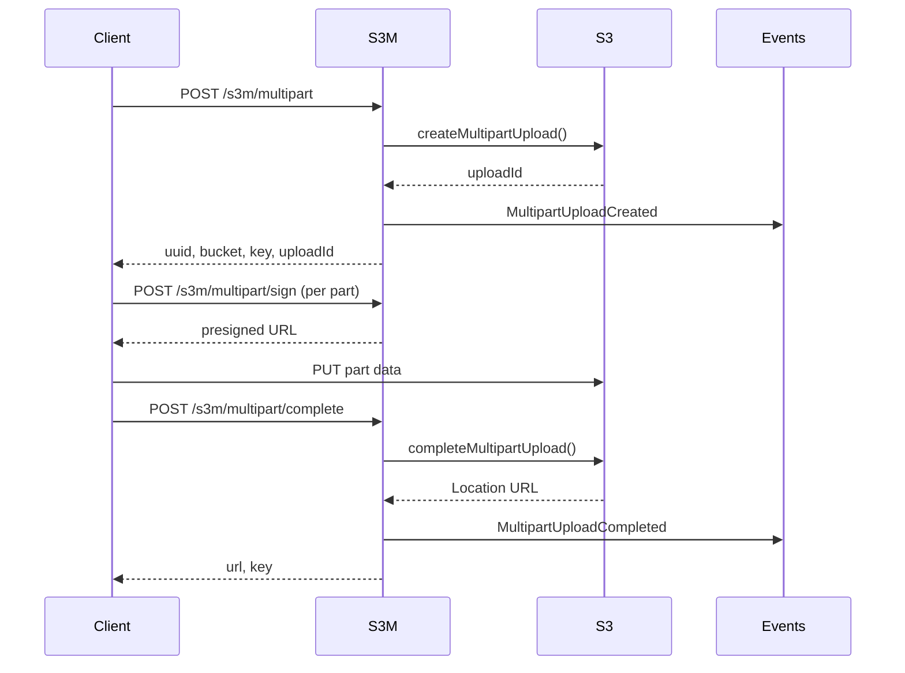

S3M dispatches events during the multipart upload lifecycle, allowing you to hook into the process and perform custom actions such as logging, notifications, or database updates.

## Available Events

### MultipartUploadCreated

Dispatched when a new multipart upload is created on S3.

**Namespace:** `MrEduar\S3M\Events\MultipartUploadCreated`

**When Dispatched:** After successfully creating a multipart upload session via the `POST /s3m/multipart` endpoint (see S3MultipartController.php:50).

#### Properties

<ResponseField name="uuid" type="string" required>
  The unique identifier generated for this upload. This UUID is used as the filename in the S3 key.
</ResponseField>

<ResponseField name="bucket" type="string" required>
  The S3 bucket where the upload is being stored.
</ResponseField>

<ResponseField name="key" type="string" required>
  The full S3 object key (path) where the file will be stored. Format: `{folder}/{uuid}`
</ResponseField>

<ResponseField name="uploadId" type="string" required>
  The AWS multipart upload ID returned by S3. Used to track and complete the upload.
</ResponseField>

#### Listening to the Event

Create a listener in your Laravel application:

```bash
php artisan make:listener LogMultipartUploadCreated
```

<CodeGroup>
```php app/Listeners/LogMultipartUploadCreated.php
<?php

namespace App\Listeners;

use MrEduar\S3M\Events\MultipartUploadCreated;
use Illuminate\Contracts\Queue\ShouldQueue;
use Illuminate\Support\Facades\Log;

class LogMultipartUploadCreated implements ShouldQueue
{
    public function handle(MultipartUploadCreated $event): void
    {
        Log::info('Multipart upload created', [
            'uuid' => $event->uuid,
            'bucket' => $event->bucket,
            'key' => $event->key,
            'upload_id' => $event->uploadId,
        ]);
        
        // Example: Store upload metadata in database
        \App\Models\Upload::create([
            'uuid' => $event->uuid,
            'bucket' => $event->bucket,
            'key' => $event->key,
            'upload_id' => $event->uploadId,
            'status' => 'in_progress',
        ]);
    }
}
```

```php app/Providers/EventServiceProvider.php
<?php

namespace App\Providers;

use Illuminate\Foundation\Support\Providers\EventServiceProvider as ServiceProvider;
use MrEduar\S3M\Events\MultipartUploadCreated;
use App\Listeners\LogMultipartUploadCreated;

class EventServiceProvider extends ServiceProvider
{
    protected $listen = [
        MultipartUploadCreated::class => [
            LogMultipartUploadCreated::class,
        ],
    ];
}
```
</CodeGroup>

<Note>
  The event uses Laravel's `Dispatchable` and `SerializesModels` traits, making it compatible with queued listeners.
</Note>

---

### MultipartUploadCompleted

Dispatched when a multipart upload is successfully completed on S3.

**Namespace:** `MrEduar\S3M\Events\MultipartUploadCompleted`

**When Dispatched:** After successfully completing a multipart upload via the `POST /s3m/multipart/complete` endpoint (see S3MultipartController.php:107).

#### Properties

<ResponseField name="bucket" type="string" required>
  The S3 bucket where the file was uploaded.
</ResponseField>

<ResponseField name="key" type="string" required>
  The full S3 object key (path) where the file is stored.
</ResponseField>

<ResponseField name="uploadId" type="string" required>
  The AWS multipart upload ID that was completed.
</ResponseField>

<ResponseField name="url" type="string" required>
  The full URL (Location) of the uploaded file on S3.
</ResponseField>

#### Listening to the Event

Create a listener in your Laravel application:

```bash
php artisan make:listener HandleMultipartUploadCompleted
```

<CodeGroup>
```php app/Listeners/HandleMultipartUploadCompleted.php
<?php

namespace App\Listeners;

use MrEduar\S3M\Events\MultipartUploadCompleted;
use Illuminate\Contracts\Queue\ShouldQueue;
use Illuminate\Support\Facades\Log;
use Illuminate\Support\Facades\Notification;
use App\Notifications\UploadCompletedNotification;

class HandleMultipartUploadCompleted implements ShouldQueue
{
    public function handle(MultipartUploadCompleted $event): void
    {
        Log::info('Multipart upload completed', [
            'bucket' => $event->bucket,
            'key' => $event->key,
            'upload_id' => $event->uploadId,
            'url' => $event->url,
        ]);
        
        // Example: Update database record
        $upload = \App\Models\Upload::where('upload_id', $event->uploadId)->first();
        if ($upload) {
            $upload->update([
                'status' => 'completed',
                'url' => $event->url,
                'completed_at' => now(),
            ]);
            
            // Notify user
            Notification::send(
                $upload->user, 
                new UploadCompletedNotification($upload)
            );
        }
    }
}
```

```php app/Providers/EventServiceProvider.php
<?php

namespace App\Providers\;

use Illuminate\Foundation\Support\Providers\EventServiceProvider as ServiceProvider;
use MrEduar\S3M\Events\MultipartUploadCompleted;
use App\Listeners\HandleMultipartUploadCompleted;

class EventServiceProvider extends ServiceProvider
{
    protected $listen = [
        MultipartUploadCompleted::class => [
            HandleMultipartUploadCompleted::class,
        ],
    ];
}
```
</CodeGroup>

<Note>
  Both events support queued listeners via Laravel's `ShouldQueue` interface, allowing you to offload heavy processing.
</Note>

## Common Use Cases

<Accordion title="Database Tracking">
  Listen to `MultipartUploadCreated` to store upload metadata in your database with status `in_progress`, then update the record to `completed` when `MultipartUploadCompleted` is dispatched.
</Accordion>

<Accordion title="User Notifications">
  Send real-time notifications to users when their uploads complete by listening to `MultipartUploadCompleted`.
</Accordion>

<Accordion title="File Processing">
  Trigger post-upload processing (virus scanning, thumbnail generation, etc.) by listening to `MultipartUploadCompleted`.
</Accordion>

<Accordion title="Analytics & Logging">
  Track upload metrics, monitor failures, and generate reports by listening to both events.
</Accordion>

## Event Flow

