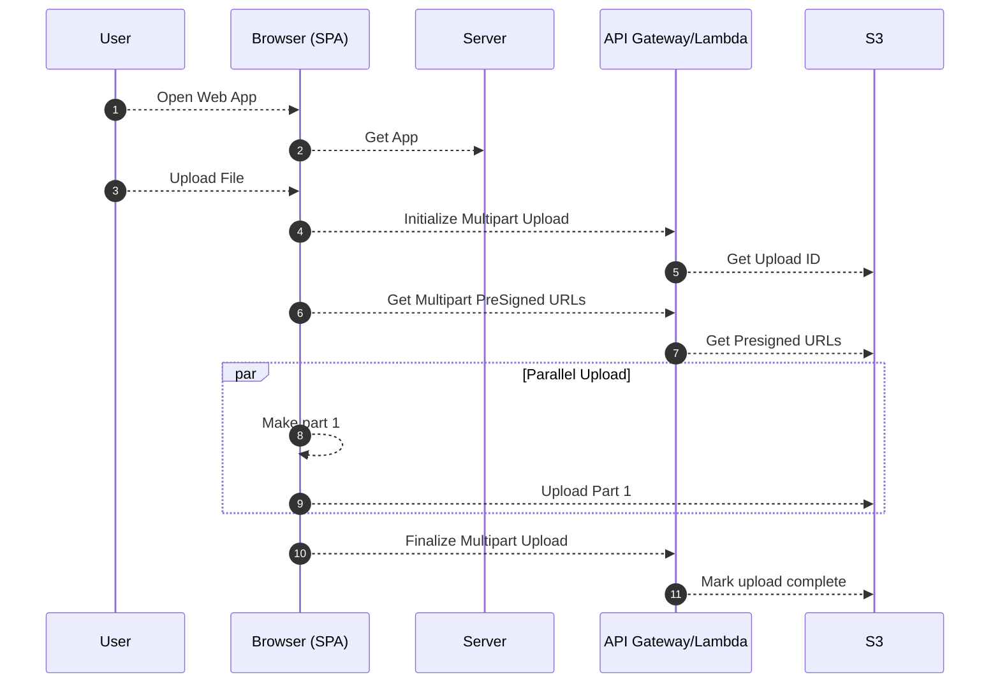

## What is S3M?

S3M is a Laravel package that enables **multipart uploads** to AWS S3, allowing you to upload large files that exceed the standard 5GB single PUT request limit. It's specifically designed for modern serverless environments where local filesystem storage is unreliable.

## Why S3M?

When running applications in serverless environments, you face unique challenges:

<CardGroup cols={2}>
  <Card title="Serverless Storage" icon="cloud">
    You can never be sure that the same serverless container will be used on subsequent requests, making local filesystem storage unreliable.
  </Card>
  <Card title="5GB Upload Limit" icon="file-arrow-up">
    AWS S3's single PUT request has a 5GB limit. S3M splits large files into smaller parts and uploads them in parallel.
  </Card>
  <Card title="Direct Browser Uploads" icon="browser">
    Upload files directly from the browser to S3 without routing through your server, reducing server load and bandwidth costs.
  </Card>
  <Card title="Cloud-First Architecture" icon="diagram-project">
    All files are stored in cloud storage (AWS S3) or shared filesystems (AWS EFS) from the start, following cloud-native best practices.
  </Card>
</CardGroup>

## Key Features

<Steps>
  <Step title="Large File Support">
    Upload files that exceed the 5GB limit by automatically splitting them into smaller chunks.
  </Step>
  
  <Step title="Parallel Uploads">
    Upload multiple file parts simultaneously for faster transfer speeds.
  </Step>
  
  <Step title="Automatic Retries">
    Failed uploads are automatically retried with configurable retry attempts.
  </Step>
  
  <Step title="Configurable Settings">
    Customize chunk size, parallel upload count, and retry attempts to match your needs.
  </Step>
  
  <Step title="Authorization Checks">
    Built-in authorization system ensures only authorized users can upload files.
  </Step>
  
  <Step title="Flexible Configuration">
    Control bucket selection, visibility, and folder structure through configuration.
  </Step>
</Steps>

## How It Works

S3M implements the AWS S3 multipart upload protocol with a streamlined workflow:

<Steps>
  <Step title="Initialize Upload">
    The browser requests an upload ID from your Laravel application.
  </Step>
  
  <Step title="Get Presigned URLs">
    Your application generates presigned URLs for each file part.
  </Step>
  
  <Step title="Upload Parts">
    The browser uploads file chunks directly to S3 using presigned URLs in parallel.
  </Step>
  
  <Step title="Complete Upload">
    After all parts are uploaded, your application marks the upload as complete.
  </Step>
</Steps>

## Use Cases

<AccordionGroup>
  <Accordion title="Serverless Applications">
    Perfect for Laravel applications deployed on AWS Lambda, Google Cloud Functions, or other serverless platforms where local storage is ephemeral.
  </Accordion>
  
  <Accordion title="Large Media Uploads">
    Handle video files, high-resolution images, and large datasets that exceed standard upload limits.
  </Accordion>
  
  <Accordion title="Direct Client Uploads">
    Reduce server bandwidth and processing by allowing browsers to upload directly to S3.
  </Accordion>
  
  <Accordion title="Cloud-Native Architecture">
    Build applications that store all files in cloud storage from day one, avoiding migration challenges later.
  </Accordion>
</AccordionGroup>

<Note>
  S3M is inspired by [Laravel Vapor](https://vapor.laravel.com/) and follows similar architecture patterns for file uploads.
</Note>

## What's Next?

<CardGroup cols={2}>
  <Card title="Installation" icon="download" href="/installation">
    Install S3M via Composer and configure your environment
  </Card>
  <Card title="Quickstart" icon="rocket" href="/quickstart">
    Get up and running with your first multipart upload
  </Card>
</CardGroup>